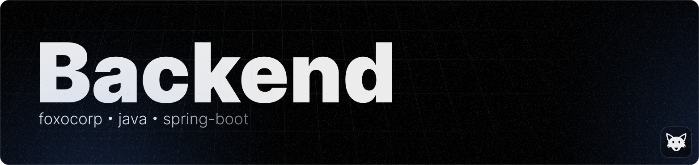

- **Website**
  - https://foxogram.su
- **Discord**
  - https://discord.foxogram.su
- **GitHub**
  - https://github.com/foxocorp
- **Support**
  - https://boosty.to/foxogram

We would like to thank the following people and organizations for their valuable input and support in the development of the backend:

- **Java** for making it possible for this project to exist
- **Foxes** they are just so cute :3

Without your help, the **Foxogram Backend** project would not have been possible. We are grateful for your participation and support!

This project is licensed under the MIT license - see [LICENSE](LICENSE) for details.

If you have any questions or problems with **Foxogram Backend**, please contact us at [Discord](https://discord.foxogram.su).
