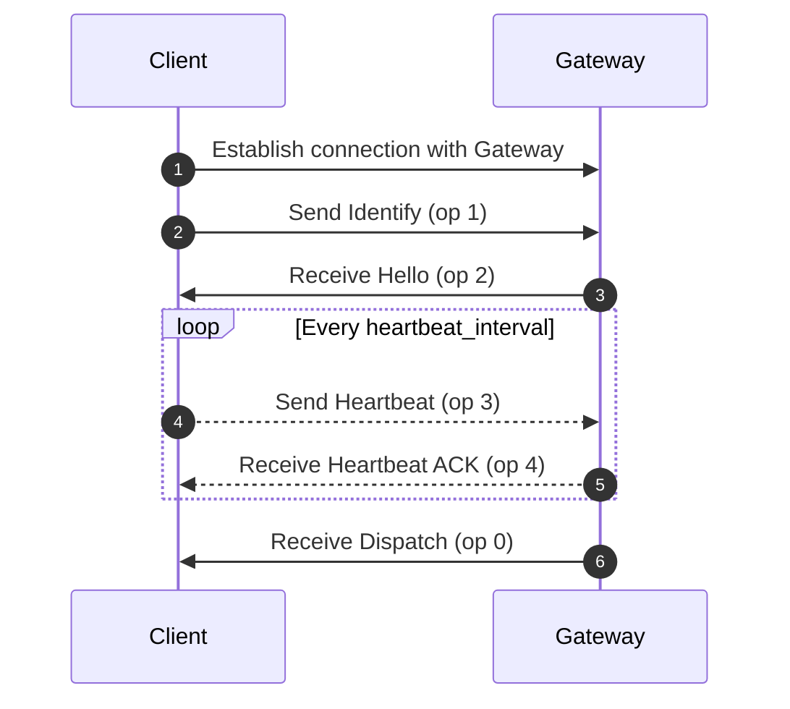

## Resources

- **Website**
    - https://foxochat.app
- **Discord**
    - https://discord.foxochat.app
- **GitHub**
  - https://github.com/foxocorp

## Acknowledgements

We would like to thank the following people and organizations for their valuable input and support in the development of the backend:

- **Java** for making it possible for this project to exist
- **Foxes** they are just so cute :3

Without your help, the **FoxoChat Backend** project would not have been possible. We are grateful for your participation
and support!

## Gateway lifecycle

## License

This project is licensed under the MIT license - see [LICENSE](LICENSE) for details.

If you have any questions or problems with **FoxoChat Backend**, please contact us
at [Discord](https://discord.foxochat.app).
